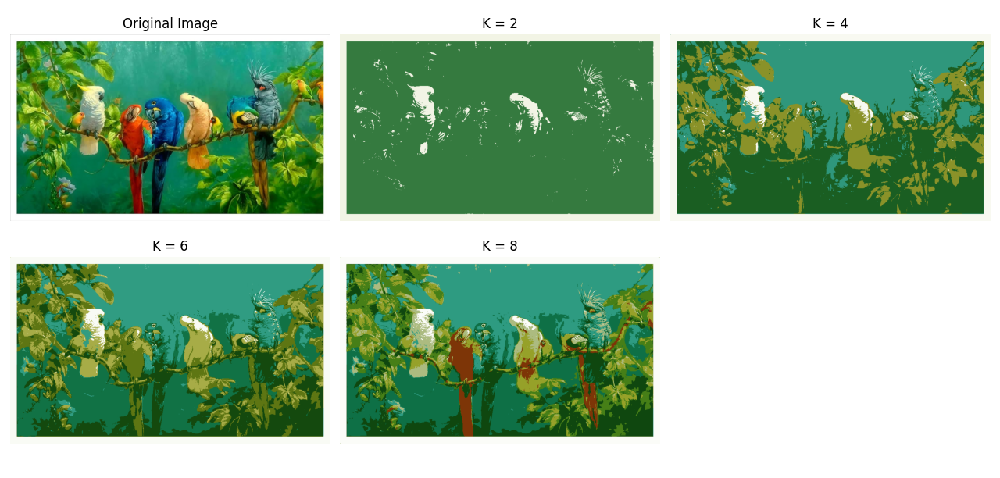
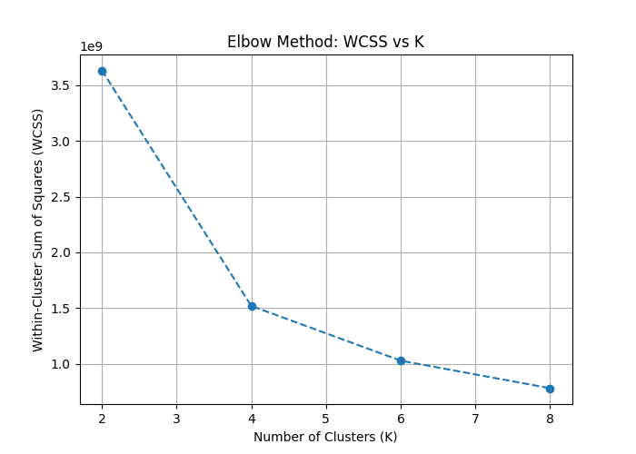

# 🎨 Image Segmentation using K-Means Clustering



A Computer Vision project that performs **color-based image segmentation** using the **K-Means Clustering Algorithm**. The project analyzes how different cluster values (**K = 2, 4, 6, and 8**) affect image segmentation quality and evaluates clustering performance using **WCSS (Within-Cluster Sum of Squares)** and the **Elbow Method**.

---

## 📌 Overview

Image segmentation is the process of partitioning an image into meaningful regions based on similar characteristics.

In this project, K-Means Clustering groups pixels with similar colors into clusters, producing segmented images with varying levels of detail. As the value of **K** increases, the segmentation preserves more colors and finer image features.

---

## 🚀 Features

✅ Color-Based Image Segmentation

✅ K-Means Clustering Implementation

✅ Multiple Cluster Analysis (K = 2, 4, 6, 8)

✅ WCSS Computation

✅ Elbow Method Visualization

✅ Segmentation Quality Comparison

✅ OpenCV-Based Image Processing

---

## 🛠️ Technologies Used

* 🐍 Python
* 👁️ OpenCV
* 🔢 NumPy
* 📊 Matplotlib

---

## ⚙️ Algorithm Workflow

### 1️⃣ Load Image

Read the input color image.

### 2️⃣ Reshape Pixel Data

Convert image pixels into a 2D array.

### 3️⃣ Apply K-Means Clustering

Cluster pixels based on color similarity.

### 4️⃣ Generate Segmented Images

Replace pixel values with their corresponding cluster centroids.

### 5️⃣ Compute WCSS

Measure clustering compactness.

### 6️⃣ Plot Elbow Curve

Analyze the optimal number of clusters.

### 7️⃣ Visualize Results

Compare segmented outputs for different values of K.

---

## 📂 Project Structure

```text
Image-Segmentation-KMeans/
│
├── Image/
│   └── birds.jpg
│
├── Output/
│   ├── k_values.png
│   └── elbow_plot.png
│
├── kmeans_segmentation.py
├── Project_Report.pdf
└── README.md
```

---

## 📈 Results

| K Value | Observation                                     |
| ------- | ----------------------------------------------- |
| 2       | Broad color regions with minimal detail         |
| 4       | Better object separation                        |
| 6       | More image details preserved                    |
| 8       | Fine segmentation with richer color information |

### Segmentation Results


---

## 📉 Elbow Method Analysis

The WCSS value decreases as K increases because clusters become more compact. The elbow curve helps determine an optimal K value where increasing clusters further yields diminishing returns.

*(Add elbow_plot.png here if available)*

```markdown

```

---

## ▶️ How to Run

### Install Dependencies

```bash
pip install opencv-python numpy matplotlib
```

### Run the Program

```bash
python kmeans_segmentation.py
```

---

## 🎯 Learning Outcomes

* K-Means Clustering
* Image Segmentation
* WCSS Analysis
* Elbow Method
* OpenCV Image Processing
* Unsupervised Learning
* Feature Representation in Images

---

## 🌍 Applications

* Medical Image Analysis
* Object Detection
* Remote Sensing
* Computer Vision Systems
* Image Compression
* Pattern Recognition

---

## 📄 Project Report

Detailed project documentation is available in:

```text
Project_Report.pdf
```

---

## 👨‍💻 Author

**Sachin Tomar**

🎓 B.Tech Mathematics & Computing
🏫 National Institute of Technology Kurukshetra

---

⭐ If you found this project useful, consider giving it a star!
